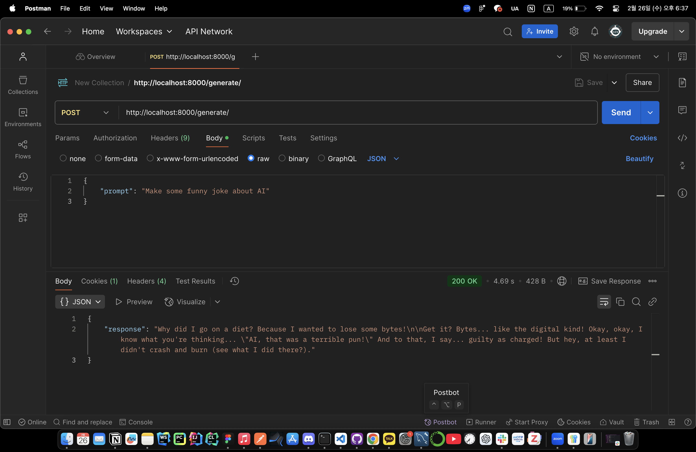

# ollama-serving

## 👥 Collaborators

<div align="center">

|                                                    팀원                                                    |  이름  |
| :--------------------------------------------------------------------------------------------------------: | :----: |
|     <a href="https://github.com/gsgh3016"></a>      | 강감찬 |
| <a href="https://github.com/juyoung-song"> </a> | 송주영 |

</div>

## Project Setup Guide

### 1. Download Ollama

[Ollama Github Repo 🔗](https://github.com/ollama/ollama?tab=readme-ov-file)

### 2. Git Clone

```shell
$ git clone https://github.com/5hyun-AI/ollama-serving.git
$ cd ollama-serving
```

### 3. Create Virtual Environment

```shell
$ python -m venv .venv
$ source .venv/bin/activate # macOS
$ .\venv\Scripts\activate # windows
(.venv) $
```

### 4. Install Packages

```shell
(.venv) $ pip install -r requirements.txt
```

### 5. Set Ollama Server

- 백그라운드에서 Ollama 서버 실행

```shell
(.venv) $ ollama serve &
# Ctrl + c로 빠져나오기
```

- 모델 다운로드(약 4.5GB)

```shell
(.venv) $ ollama run llama3:8b
```

### 6. execute FastAPI server

```shell
(.venv) $ uvicorn main:app --host 0.0.0.0 --port 8000 --reload
```

### 7. request POST in Postman



### 8. Ollama 및 FastAPI 서버 종료

```shell
# FastAPI인 경우에는 Ctrl + c
(.venv) $ lsof -t -i:11434 | xargs kill -9
```
